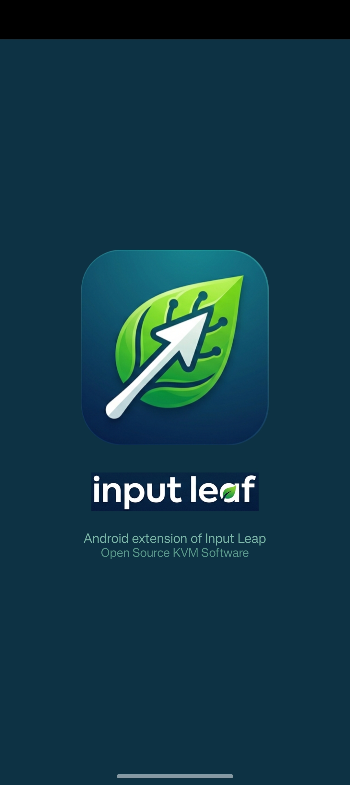
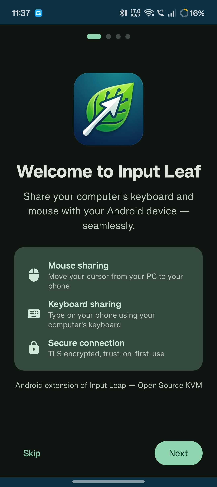
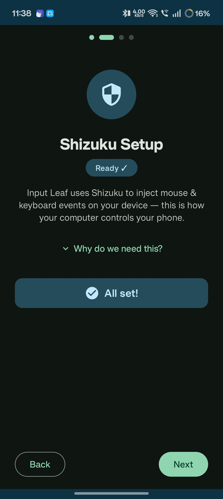
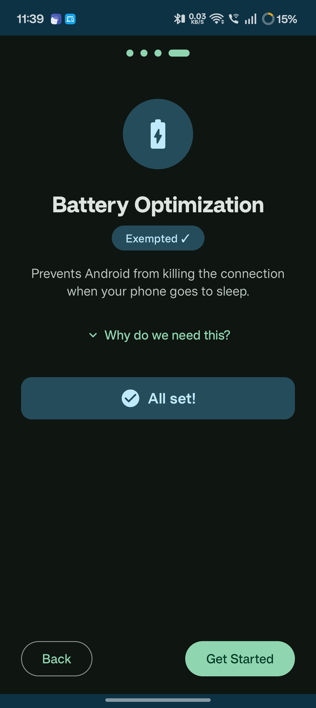
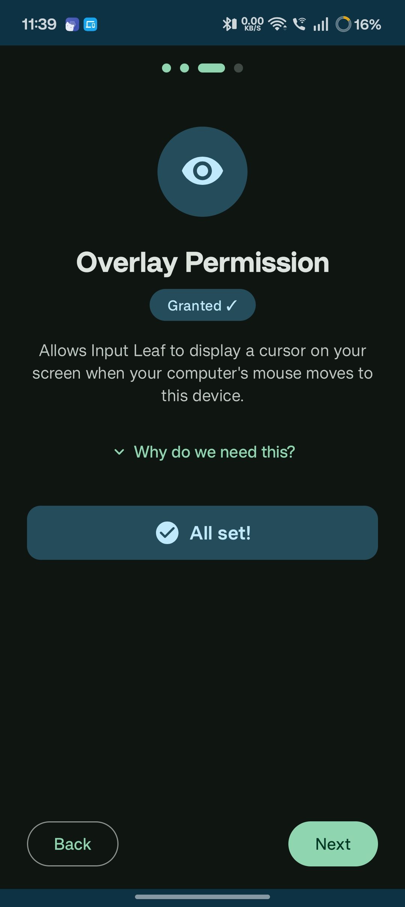
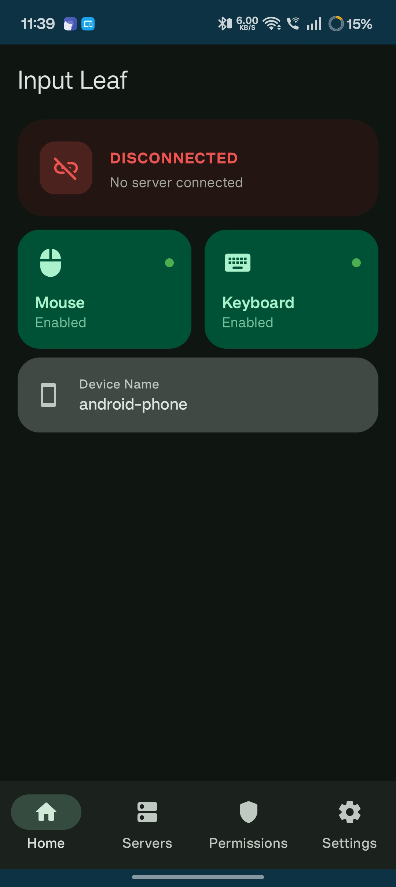
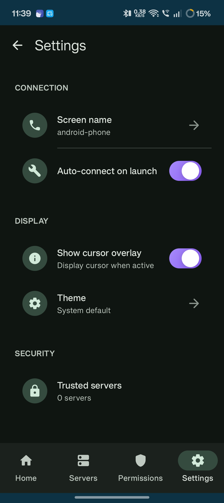

# Input Leaf

**Input Leaf** is an open-source Android client for [Input Leap](https://github.com/input-leap/input-leap) — a KVM software switch that lets you control your Android device using your PC or laptop's existing mouse and keyboard.

Simply move your cursor to the edge of your screen on your PC, and it seamlessly crosses over to your Android device — no extra hardware, no USB cables, just your local network.

> 🖱️ **PC/Laptop mouse & keyboard → controls your Android device**

---

## ⚠️ Important Dependencies

To use Input Leaf, you **must** have the following set up:

1. **[Input Leap](https://github.com/input-leap/input-leap)** — The server must be running on your PC or laptop. Input Leaf connects to it as a client over your local network.
2. **Input method — pick one:**
   - **[Shizuku](https://shizuku.rikka.app/)** _(recommended)_ — Rootless, system-level mouse & keyboard injection with the lowest latency.
   - **Accessibility Service** _(no-root alternative)_ — Works on any stock Android device with no extra apps. Enable Input Leaf in **Settings → Accessibility** to use it.

> Both methods can be active at the same time. Shizuku takes priority when available.

---

## Features

- **Seamless Input Sharing** — Use your PC's mouse and keyboard to control your Android device, just like an extra monitor.
- **Dual Input Methods** — Shizuku for max performance, Accessibility Service for plug-and-play compatibility.
- **Auto-Reconnect** — Automatically reconnects to the last server after a network drop, with exponential back-off.
- **Modern UI/UX** — Beautiful Material interface with color-coded connection statuses.
- **Easy Toggling** — Quickly enable or disable input control on the fly.
- **Server Discovery** — Automatically scan your local network for active Input Leap servers.
- **Quick Favorites** — Save frequently used servers for one-tap connections from the home screen.
- **Guided Setup** — Built-in 5-step wizard for configuring input methods and required system permissions.
- **No Root Required** — Works entirely through Shizuku or the Accessibility Service, keeping your device secure.
- **TLS-Secured Connection** — Trust-on-first-use (TOFU) certificate pinning for encrypted connections.

---

## How It Works

```
[ PC / Laptop ]  ──── Local Network ────  [ Android Device ]
  Input Leap Server                          Input Leaf App
  (mouse + keyboard)          →          (receives input events)
```

1. Run Input Leap on your PC and add your Android device as a screen.
2. Install Input Leaf on your Android device and connect to the server.
3. Move your cursor past the screen edge on your PC — it jumps to your Android device.

---

## Input Method Comparison

| Feature | Shizuku (Recommended) | Accessibility & Virtual Keyboard |
|---|---|---|
| **Setup** | Install Shizuku app + grant permission | Enable in Accessibility Settings & Select Virtual Keyboard |
| **Mouse (Absolute)** | ✅ | ✅ |
| **Mouse (Relative)** | ✅ | ✅ (touch-based emulation) |
| **Keyboard** | ✅ | ✅ |
| **System Shortcuts** (Alt+Tab, Meta+D) | ✅ **Fully Supported** | ❌ **Not Supported** |
| **Root required** | ❌ | ❌ |
| **Extra app required** | ✅ Shizuku | ❌ |
| **Latency** | **Lowest** (Direct Injection) | **Low** |

### 🔍 Method Breakdown

**1. Shizuku (Seamless Injection)**
This is the recommended method. Shizuku allows Input Leaf to inject mouse and keyboard events directly at the Android OS level. 
* **Pros:** Extremely low latency. System-level keyboard shortcuts (like `Alt+Tab` for recent apps, `Windows+D` for home screen, etc.) work exactly like they would on a physical Bluetooth keyboard.
* **Cons:** Requires the one-time setup of the Shizuku app via Wireless Debugging or ADB.

**2. Accessibility & Virtual Keyboard**
This is a pure plug-and-play fallback. It uses Android's Accessibility APIs to emulate touch events for the mouse, and sets Input Leaf as your active software keyboard to receive keystrokes.
* **Pros:** No extra apps required. Works out of the box by just granting Accessibility permissions and selecting the keyboard.
* **Cons:** Because it's a software keyboard, it cannot capture hardware-level OS shortcuts like `Alt+Tab` or `Meta` key combinations. Mouse movement is simulated via touch gestures, which can feel slightly different than true hardware injection.

---

## Screenshots

| | | |
|:---:|:---:|:---:|
| |  | |
| |  | |
|  |  |  |
|  |  | |

---

## Getting Started / Installation

Ready to build Input Leaf from source?

Check out the **[Installation & Build Wiki](https://github.com/anasvhora284/input-leaf/blob/master/docs/WIKI_INSTALL_GUIDE.md)** for step-by-step instructions on setting up your build environment (JDK, Gradle, ADB) and compiling the APK.

---

## Contributing

Contributions, issues, and feature requests are welcome! Feel free to open an issue or submit a pull request.

---

## License

This project is open-source. See the [LICENSE](LICENSE) file for details.
