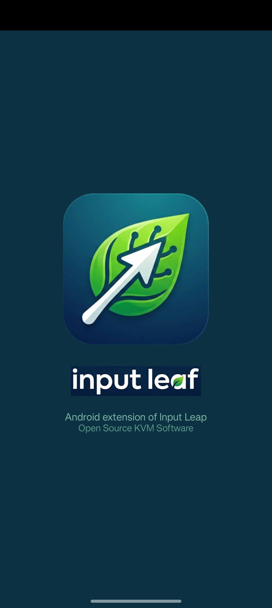
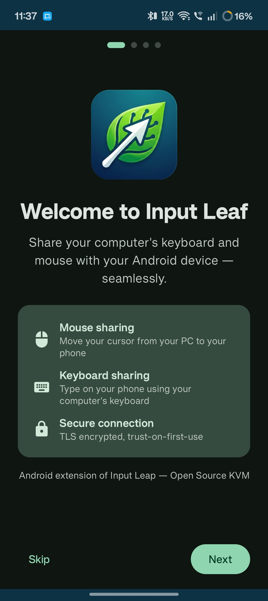
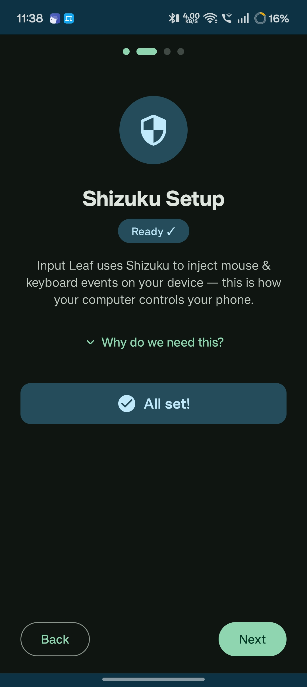
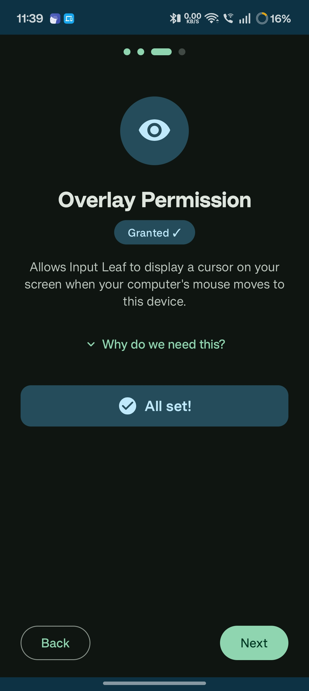
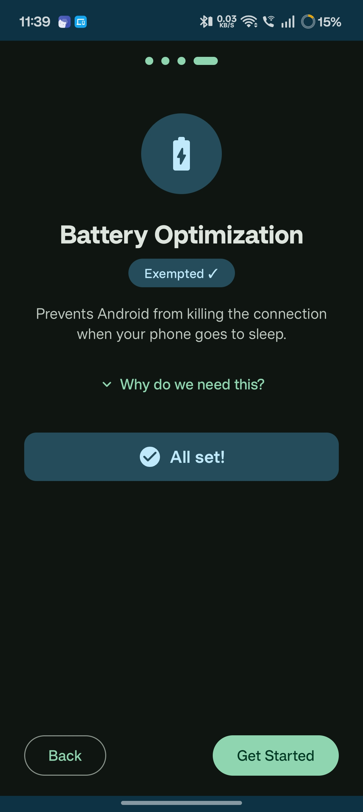
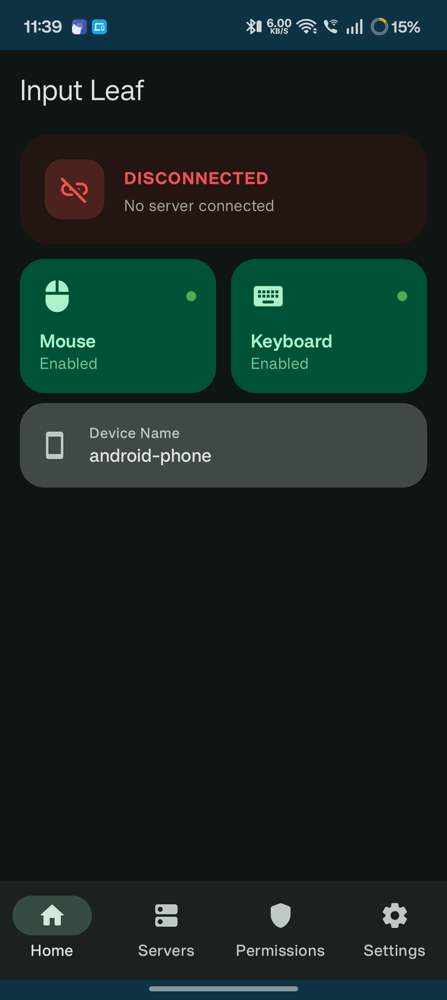
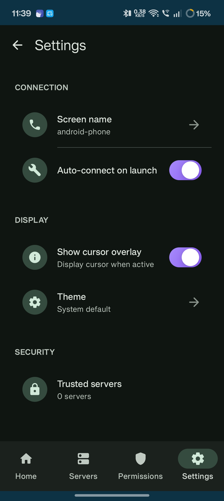

# Input Leaf 🍃

**Use your PC's mouse and keyboard to control an Android phone over your local network.** Input Leaf is a free, open-source Android client for **Input Leap** and compatible **Deskflow** setups. It turns your Android device into another screen in your software KVM workflow — no USB cable and no root required.

[](https://github.com/anasvhora284/input-leaf/releases/latest)
[](https://github.com/anasvhora284/input-leaf/stargazers)
[](https://github.com/anasvhora284/input-leaf/actions/workflows/ci.yml)
[](LICENSE)

**[Download APK](https://github.com/anasvhora284/input-leaf/releases/latest) · [Website](https://inputleaf.anasvhora.tech/) · [Issues](https://github.com/anasvhora284/input-leaf/issues) · [Discussions](https://github.com/anasvhora284/input-leaf/discussions)**

> 🖱️ **PC mouse + keyboard → local network → Android phone/tablet**

## What is Input Leaf?

Input Leaf is an **Android client for Input Leap** that lets you share a computer's mouse and keyboard with an Android device. Configure the Android device as a screen on your Input Leap server, then move the desktop cursor to the edge of the screen to switch control to Android.

It is designed for people searching for an **Input Leap Android client**, **Deskflow Android client**, **Android software KVM**, or a way to **use a PC keyboard and mouse on an Android phone** over Wi-Fi/LAN.

### Why Input Leaf?

- **No root required** — use Shizuku or Android Accessibility APIs.
- **Low-latency input** — Shizuku provides direct system-level input injection.
- **Mouse + keyboard sharing** — control Android from the same mouse and keyboard you already use on your PC.
- **Input Leap compatible** — works as an Android client for Input Leap.
- **Deskflow compatible** — supports compatible Deskflow server configurations.
- **Local network** — communication stays on your LAN instead of requiring a cloud service.
- **Server discovery** — automatically finds compatible servers on the local network.
- **TLS support** — supports encrypted connections and trust-on-first-use certificate pinning.
- **Automatic reconnect** — reconnects after temporary network interruptions.

## Download

**[Download the latest Input Leaf APK](https://github.com/anasvhora284/input-leaf/releases/latest)**

Universal and device-architecture APKs are published with releases. Choose `universal.apk` if you are unsure which architecture your Android device uses.

## Requirements

### PC / server

You need an **Input Leap** server or a compatible **Deskflow** server running on your computer.

- [Input Leap](https://github.com/input-leap/input-leap) — open-source software KVM for sharing a mouse and keyboard between computers.
- [Deskflow](https://github.com/deskflow/deskflow) — a modern software KVM project compatible with the same general workflow.

### Android

Input Leaf supports two input-injection modes:

1. **Shizuku — recommended**
   - Rootless system-level input injection.
   - Best support for keyboard shortcuts and low-latency input.
   - Requires the [Shizuku](https://shizuku.rikka.app/) app and its one-time Wireless Debugging/ADB setup.

2. **Accessibility Service — no extra app**
   - Works on stock Android without root or Shizuku.
   - Uses Android Accessibility APIs and Input Leaf's virtual keyboard.
   - Some hardware-level/system keyboard shortcuts are not available in this mode.

## Quick Start

1. Install **Input Leap** or compatible **Deskflow** server software on your PC.
2. Configure your Android device as a client/screen on the server.
3. Install the latest **Input Leaf APK** on Android.
4. Open Input Leaf and complete the setup wizard.
5. Choose **Shizuku** for the best input experience, or enable Accessibility mode.
6. Connect Input Leaf to your PC/server over the same local network.
7. Move your PC cursor across the configured screen edge — control moves to Android.

```text
┌─────────────────────┐       Wi-Fi / LAN       ┌─────────────────────┐
│ PC / Laptop         │                         │ Android             │
│                     │                         │                     │
│ Input Leap /        │ ──────────────────────> │ Input Leaf          │
│ Deskflow server     │   mouse + keyboard      │ Android client       │
└─────────────────────┘                         └─────────────────────┘
```

For detailed setup instructions, see the **[Input Leaf website](https://inputleaf.anasvhora.tech/)**.

## Features

- **Seamless input sharing** — use a PC mouse and keyboard to control Android like another screen.
- **Dual input methods** — Shizuku for performance and Accessibility for compatibility.
- **Mouse input** — absolute and relative mouse movement.
- **Keyboard input** — regular typing plus supported system shortcuts in Shizuku mode.
- **Auto-reconnect** — exponential back-off after network drops.
- **Server discovery** — scan the LAN for available Input Leap/Deskflow servers.
- **Quick favorites** — save frequently used servers for fast connections.
- **Guided setup** — built-in setup flow for input methods and Android permissions.
- **No root** — designed to work on standard Android devices.
- **TLS-secured connections** — encrypted server connections with certificate trust-on-first-use.

## Shizuku vs Accessibility

| Capability | Shizuku (Recommended) | Accessibility |
|---|---|---|
| Root required | ❌ No | ❌ No |
| Extra app | ✅ Shizuku | ❌ No |
| Mouse | ✅ | ✅ |
| Keyboard | ✅ | ✅ |
| Relative mouse | ✅ | ✅ Touch-based emulation |
| System shortcuts | ✅ Best support | ⚠️ Limited |
| Input latency | **Lowest** | Low |

### Shizuku mode

Shizuku allows Input Leaf to inject mouse and keyboard events at the Android system level. This provides the closest experience to a physical mouse and keyboard and enables supported shortcuts such as `Alt+Tab` and `Meta` combinations.

### Accessibility mode

Accessibility mode is the simplest no-extra-app fallback. It uses Android Accessibility APIs for mouse interaction and a virtual keyboard for keyboard input. Because Android treats it differently from hardware/system input, some OS-level shortcuts are unavailable.

## Compatibility

Input Leaf is primarily intended for:

- Android phones and tablets
- Input Leap servers on Windows, macOS, Linux and other supported desktop platforms
- Compatible Deskflow server configurations
- Local Wi-Fi or Ethernet networks
- Rootless Android setups using Shizuku or Accessibility

Actual behavior can vary by Android version, device manufacturer and OEM background/permission policies.

## Troubleshooting

### Input Leaf cannot find my server

- Confirm the PC and Android device are on the same LAN/Wi-Fi network.
- Make sure the Input Leap/Deskflow server is running.
- Check the server's configured screen/client name.
- Check firewall rules on the PC.
- Try entering the server address manually.

### Keyboard shortcuts do not work

Use **Shizuku mode** for the best system-level keyboard support. Accessibility/virtual-keyboard mode cannot reproduce every hardware-level Android shortcut.

### Shizuku is not working

Make sure Shizuku is running and Input Leaf has been granted the required Shizuku permission. Wireless Debugging/ADB setup may need to be repeated after a reboot on some devices.

### Connection drops in the background

Android OEM battery-management features can stop background services. Allow Input Leaf to run in the background and disable battery optimization for Input Leaf if your device aggressively suspends apps.

## Screenshots

### Splash & Setup

| | |
|:---:|:---:|
|  |  |

### Permissions

| | | |
|:---:|:---:|:---:|
|  |  |  |

### Main App

| | |
|:---:|:---:|
|  |  |

## Frequently Asked Questions

### Can I control my Android phone with my PC mouse and keyboard?

Yes. Input Leaf receives mouse and keyboard input from an Input Leap-compatible server over your local network.

### Does Input Leaf require root?

No. Input Leaf can use Shizuku or Android Accessibility APIs, so a rooted device is not required.

### Is Input Leaf an Input Leap client for Android?

Yes. Input Leaf is specifically built as an Android client for Input Leap and also supports compatible Deskflow configurations.

### Does it work over Wi-Fi?

Yes. The Android device and server communicate over the local network. Wi-Fi is supported as long as the devices can reach each other and the server port is accessible.

### Is Input Leaf free and open source?

Yes. The project is open source and licensed under Apache License 2.0.

### Does it work without Shizuku?

Yes. Accessibility mode is available as a no-extra-app fallback, although it has more limitations than Shizuku for system-level input.

## Contributing

Contributions, bug reports, documentation improvements and feature requests are welcome.

- **[Report a bug](https://github.com/anasvhora284/input-leaf/issues/new/choose)**
- **[Start a discussion](https://github.com/anasvhora284/input-leaf/discussions)**
- **[Open a pull request](https://github.com/anasvhora284/input-leaf/pulls)**

Before opening an issue, please include your Android version, device model, Input Leaf version, server software/version and relevant logs when possible.

## Related Projects

- **[Input Leap](https://github.com/input-leap/input-leap)** — open-source software KVM server/client project.
- **[Deskflow](https://github.com/deskflow/deskflow)** — cross-platform keyboard and mouse sharing software.
- **[Shizuku](https://shizuku.rikka.app/)** — Android system API access without root for supported use cases.

## License

Input Leaf is licensed under the **Apache License 2.0**. See [LICENSE](LICENSE) for the complete license text.
